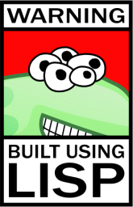

# AIWithLisp

Simple AI exercises using and learning Common Lisp during my class: "Introduction to Artificial Intelligence
" at the Computer Research Center [CIC](hhttps://www.cic.ipn.mx/index.php/es/) at my university.

## Demo
[You can try any of the projects in this page](http://idic.likufanele.com/~fundamentosia/)

Note that this is a server of the university so it is not very reliable.

## Mazes
This is an AI that solves any maze you throw at it, it has multiple versions including 3D mazes.

[Show me the code](Exam1)

## Tic-tac-toe / 4 in line (gato)
This is a classic AI puzzle, to create an agent that wins any tic-tac-toe match it can.
The server is really unrealible in this one.

[Show me the code](Gato)

## Microworlds
Created an agent that was responsible for the movements / decisions of the animals of a world
to archive equilibrium, using a paradigm based on rules, I created rules to make the ecosystem thrive.

[Show me the code](MicroMundo)

